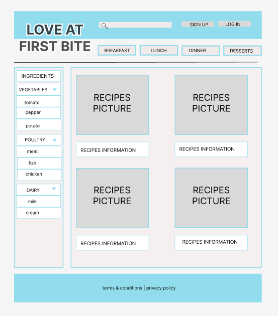
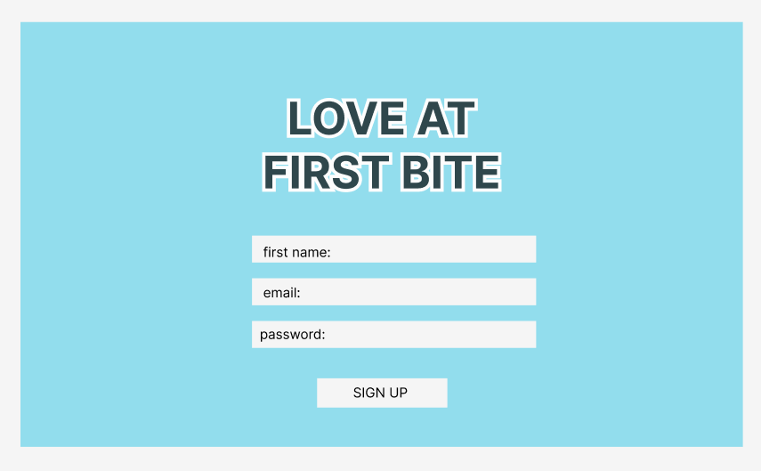
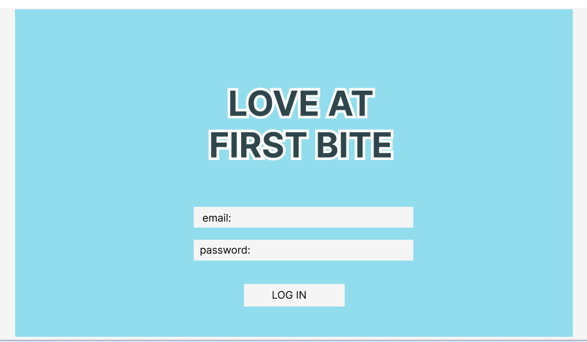
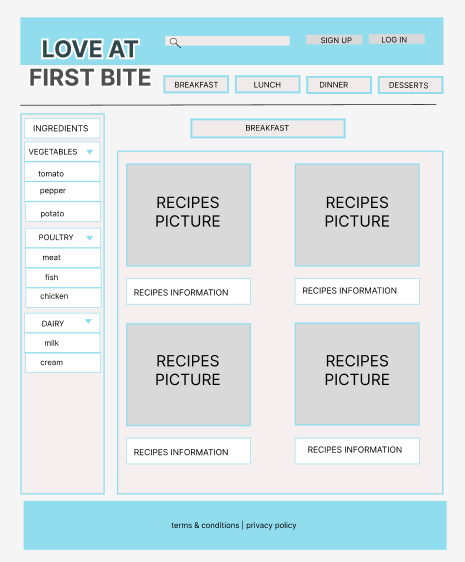
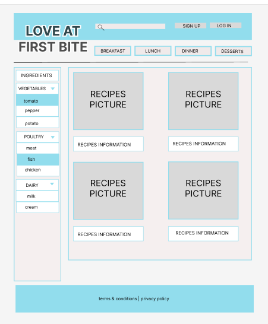
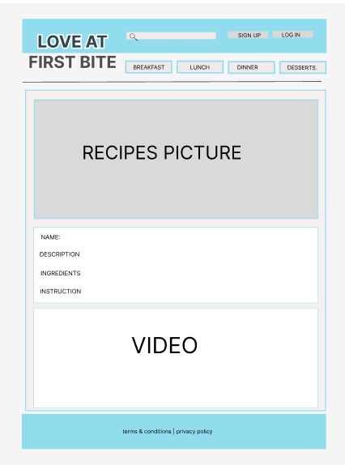

# Project-2
#done by manar ahmed - salman murtaza - ali mohammed 
  
  
  
  
  
  
  
  

## in the future we are going to do a feature that the user can find recipes by selecting some ingredients he/she has.

## unsolved problem :delete recipe feature 

[trello](https://ga-tamkeenbh.slack.com/archives/D05921XBL07/p1686560451540389)
  
 
